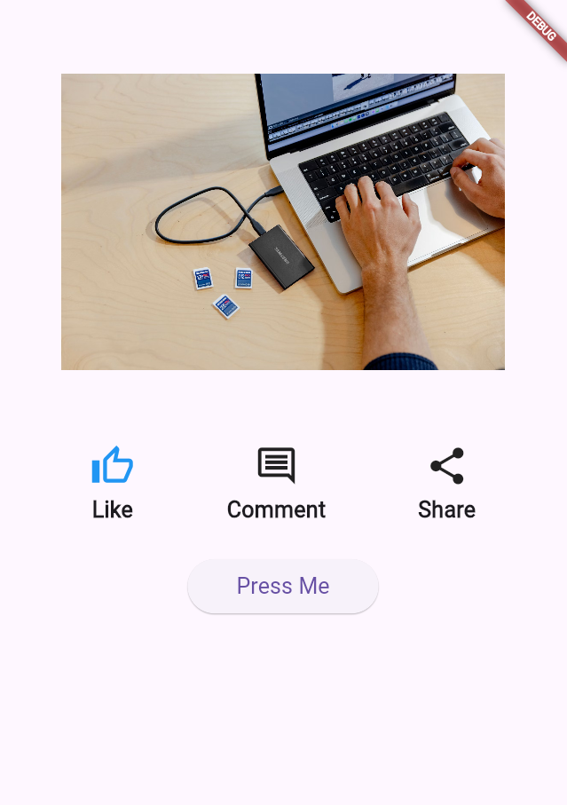
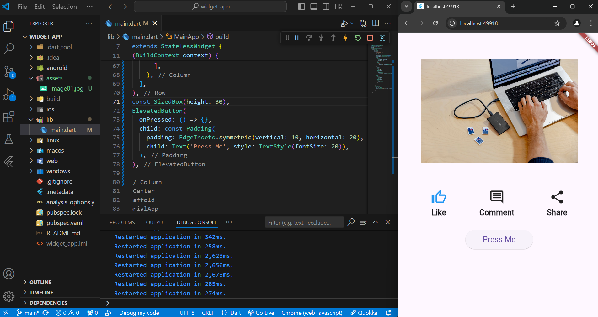

# Widget App

This project is **Task 1** of **Lab 3** assignment for the **Mobile App Development Course**. The goal of this task is to create a Flutter app named `widget_app` that demonstrates the usage of common Flutter widgets, including `Text`, `Icon`, `ElevatedButton`, `Image`, `Row`, and `Column`.

## Project Overview

The `widget_app` showcases how various Flutter widgets can be combined to build a simple UI. The app layout includes:

- An **image** displayed at the top of the screen.
- A **row** of icons and text elements positioned below the image.
- An **elevated button** placed at the bottom of the screen.

The task involves constructing these elements within a `Column` widget, arranging them in a logical and visually appealing manner.

## Task Description

- **Objective**: Build a new Flutter app demonstrating common Flutter widgets.
- **Widgets used**: 
  - `Text`
  - `Icon`
  - `ElevatedButton`
  - `Image`
  - `Row`
  - `Column`
  
- **App Layout**:
  - An image at the top.
  - A row of icons and text below the image.
  - An elevated button at the bottom of the screen.

- **Functionality**: 
  - The app visually displays these components in a simple and responsive layout.
  - Ensure the app runs correctly on an emulator or device.

## Running the App

To run the app:

1. Clone this repository.
2. Navigate to the project directory.
3. Run `flutter pub get` to install dependencies.
4. Execute `flutter run` to launch the app on an emulator or physical device.

## Screenshots

---

This app demonstrates the basic building blocks of Flutter and helps in understanding how to use common widgets to build simple yet effective user interfaces.
